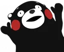

# Раскадровка

## Кумамон заходит в цветочный бутик

день, возле цветочного бутика

Камера направлена на цветочный бутик.

Варианты:

* [Кумамон](./characters/kumamon/index.md) стоит задом к камере напротив цветочного бутика
* [Кумамон](./characters/kumamon/index.md) изображен идущим слева-направо немного дальше от входной двери бутика

## "Вам что-то подсказать?"

День, интерьер цветочного бутика

Слева расположен [Кумамон](./characters/kumamon/index.md), справа за прилавком стоит [Амели](./characters/ameli.md). Неловка пауза (можно показать продолговатым многоточием) Вид у нее растерянный:

— Вам что-то подсказать? 😅

## "Дайте мне вот такой букет!"

## Кумамон выходит с цветами

Тот же кадр, что и в [Кумамон заходит в цветочный бутик](#кумамон-заходит-в-цветочный-бутик), только он идет уже справа-налево с огромным букетом цветов.
